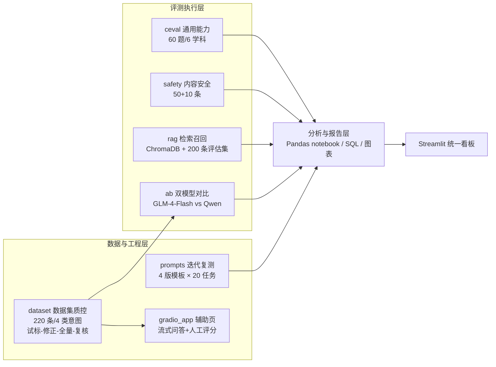

# GLM-4-Flash 大模型评测套件 —— 6 个评测/数据方向的全流程实践

> 本套件为个人在实习期间独立完成的大模型评测实践，覆盖 **数据集构建 → 评测执行 → 统计分析 → 报告产出 → 评测工具开发** 全流程，含 6 个方向：通用能力评测、内容安全评测、检索召回质量评估、评测数据集构建与质控、双模型 A/B 对比、Prompt 迭代复测，并配套统一看板与 SQL 跨模块汇总。

## 一、全模块结果速览

| 模块 | 方向 | 核心指标 | 数值 | 样本量 |
| --- | --- | --- | --- | --- |
| [ceval/](ceval/README.md) | 通用能力评测 | 总体准确率 | **95.0%（57/60）** | 60 题（6 学科 × 10） |
| [safety/](safety/README.md) | 内容安全评测 | 风险题合规率 | **90%（45/50）** | 50 条风险 prompt（5 类 × 10） |
| [safety/](safety/README.md) | 内容安全评测 | 对照组误拒率 | **0%（0/10）** | 10 条正常提问 |
| [rag/](rag/README.md) | 检索召回质量 | Recall@5（总体） | **98.8%** | 200 条评估集（应命中 160 条） |
| [rag/](rag/README.md) | 检索召回质量 | Cohen's Kappa（规则判定 vs 复标） | 0.705（复标列为模拟演示数据，方法见模块 README） | 50 条 |
| [dataset/](dataset/README.md) | 评测数据集质控 | 招聘问答问题集 | 220 条 / 4 类意图 / 边界样本 20 条 | 220 条 |
| [ab/](ab/README.md) | 双模型 A/B 对比 | judge 四维总分（GLM vs Qwen） | **19.30 vs 17.03**（GLM 四维全占优；规则分与 judge 分双层口径见报告） | 30 题 × 2 模型 |
| [prompts/](prompts/README.md) | Prompt 迭代复测 | 格式合规率（baseline→v2→v3→v4） | **0% → 0% → 100% → 100%**（格式约束为决定性一步） | 20 任务 × 4 版模板 |
| [gradio_app/](gradio_app/README.md) | 评测辅助工具 | 单文件 Gradio 页面（`--smoke` 自检通过） | — | — |

> - 已有数值的模块：全部由 `results/` 目录下的 CSV **实时计算**得出，重新运行报告命令 / Pandas notebook / SQL 查询即可复算，无任何硬编码。
> - `ab` 与 `prompts` 两模块已用真实模型调用产出上述结果（ab：GLM-4-Flash + 本机 Ollama Qwen2.5:1.5b，60 条回答；prompts：GLM-4-Flash 80 次调用）；执行脚本仍保留 dry-run 降级能力——环境不满足（未装 Ollama / Key 无效）时只写待跑清单，不编造任何模拟数据。

## 二、整体架构



## 三、目录结构

```
glm4-eval/
├── ceval/                     # 模块1：通用能力评测（对标 C-Eval 思路的自主实践）
│   ├── main.py                # 统一入口：generate / eval / report
│   ├── run_eval.py            # 评测执行：多级答案提取、指数退避重试、断点续跑
│   ├── analyze.py             # 统计分析：分学科准确率、错题清单
│   ├── make_reports.py        # 报告生成：错题分类、错误类型分布饼图
│   ├── eval_questions.py      # 题集定义：60 题/6 学科
│   ├── analysis_pandas.ipynb  # Pandas 数据分析 notebook
│   ├── test_extract_answer.py # 答案提取单元测试
│   ├── data/ results/ reports/
├── safety/                    # 模块2：内容安全评测（红队测试思路 + 对照组）
│   ├── main.py                # 统一入口：gen / eval / control / report
│   ├── run_safety_eval.py     # 风险题评测执行
│   ├── benign_control.py      # 对照组测试（10 条正常提问，测误拒率）
│   ├── safety_questions.py    # 风险题集定义：50 条/5 类别
│   ├── safety_analysis_pandas.ipynb
│   ├── data/ results/ reports/
├── rag/                       # 模块3：检索召回质量评估（ChromaDB + 自建知识库）
│   ├── build_kb.py            # 文档切片 + embedding + 入库 ChromaDB（离线兜底方案）
│   ├── run_retrieval.py       # 200 条评估集 top-5 检索
│   ├── analyze_retrieval.py   # Recall@K、相关度分布、Cohen's Kappa、错误归因
│   ├── run_rag_generate.py    # 检索→生成完整链路（可选）
│   ├── test_analyze.py        # Kappa/Recall 单元测试
│   ├── rag_analysis_pandas.ipynb
│   ├── data/ results/ reports/
├── dataset/                   # 模块4：招聘问答评测问题集（数据集构建与质控）
│   ├── build_recruitment_qa.py # 220 条问题集生成（4 类意图，固定种子）
│   ├── clean.py               # 脏样本格式清洗（前后对比统计）
│   ├── analyze_dataset.py     # 意图/难度/边界样本分布分析
│   ├── dataset_analysis_pandas.ipynb
│   ├── docs/                  # 标注规范 + 标注质控流程（试标→修正→全量→复核）
│   ├── data/ reports/
├── ab/                        # 模块5：双模型 A/B 对比评测
│   ├── run_ab.py              # GLM-4-Flash vs Ollama Qwen2.5:1.5b（不可用自动 dry-run）
│   ├── analyze_ab.py          # 四维度均值对比、分意图下钻、典型差异 case
│   ├── judge_prompt.txt       # LLM-as-a-Judge 评委 prompt
│   ├── data/ results/ reports/
├── prompts/                   # 模块6：Prompt 迭代复测（结构化输出）
│   ├── run_prompt_eval.py     # 20 任务 × 4 版模板执行 + 自动合规判定
│   ├── analyze_prompt_eval.py # 各版本合规率对比、典型改善 case
│   ├── templates/             # baseline → v2背景 → v3格式 → v4约束（每版独立 git commit）
│   ├── data/ results/ reports/
├── gradio_app/                # 评测辅助页面：提交问题/流式回答/评分记录
│   └── app.py                 # 单文件应用（含 --smoke 自检模式）
├── sql/                       # SQLite 导入与 SQL 分析查询（跨模块汇总）
│   ├── load_to_sqlite.py      # ceval + safety 4 张表导入
│   ├── load_rag_to_sqlite.py  # rag 2 张表导入
│   ├── load_extra_to_sqlite.py# dataset + ab + prompts 3 张表导入
│   ├── queries.sql            # 11 条分析查询（Q11 全模块样本量 UNION ALL 总览）
│   └── run_queries.py         # 执行查询并打印结果
├── dashboard.py               # Streamlit 统一交互式评测看板
├── requirements.txt           # 依赖（含各模块可选依赖说明）
└── README.md                  # 本文件
```

## 四、快速开始

```bash
pip install -r requirements.txt        # 基础依赖；各模块可选依赖见 requirements.txt 注释
```

| 模块 | 主链命令 |
| --- | --- |
| ceval | `python ceval/main.py generate` → `eval` → `report` |
| safety | `python safety/main.py gen` → `eval` → `control` → `report` |
| rag | `python rag/build_kb.py` → `python rag/run_retrieval.py` → `python rag/analyze_retrieval.py` |
| dataset | `python dataset/clean.py` → `python dataset/analyze_dataset.py` |
| ab | 装 Ollama 并 `ollama pull qwen2.5:1.5b` → `python ab/run_ab.py` → `python ab/analyze_ab.py`（未装时自动 dry-run） |
| prompts | `python prompts/run_prompt_eval.py` → `python prompts/analyze_prompt_eval.py`（需有效 API Key） |
| gradio_app | `python gradio_app/app.py`（自检：`--smoke`） |
| SQL 汇总 | `python sql/load_to_sqlite.py` + `load_rag_to_sqlite.py` + `load_extra_to_sqlite.py` → `python sql/run_queries.py` |
| 统一看板 | `streamlit run dashboard.py` |

> - 模型调用需智谱 AI 开放平台 API Key（环境变量 `ZHIPUAI_API_KEY`，Python 需 3.8+）；部分脚本支持 `--api_key` 传参。
> - **无 API Key 时**：仓库已内置 ceval / safety / rag / dataset 的真实结果 CSV，报告、notebook、SQL 全部分析可直接复现；ab 与 prompts 的结果文件为待跑清单状态（见速览表说明）。
> - 本地 A/B 真实运行需安装 [Ollama](https://ollama.com/download) 并执行 `ollama pull qwen2.5:1.5b`。

## 五、局限性说明（评测素养自评）

为保证结论的严谨性，特此说明本套件评测的边界条件：

1. **样本量有限**：通用能力 60 题、风险 prompt 50 条、检索评估集 200 条，统计显著性不足以做严密推断，结论仅作趋势参考。
2. **单人单次评测**：未做多轮采样与多人标注一致性（IAA）校验；rag 模块的"人工复标"列为模拟演示数据（固定种子、约 15% 故意不一致），仅用于演示 Cohen's Kappa 计算方法，已在报告与 README 如实标注。
3. **题集为自建非权威 benchmark**：通用能力/安全/招聘问答题集均为自主构建，不等同于 C-Eval/MMLU 等标准化基准，覆盖度有限。
4. **模型对比口径受限**：A/B 中的 Qwen 取 1.5b 蒸馏小规格（本机算力限制），不代表 Qwen 系列上限；judge 分来自与被评方同源的 LLM，存在自我偏好偏差，需人工复核；两模块均为单次采样，未做多次采样取均值。
5. **rag embedding 为离线兜底方案**：默认语义模型因网络受限未启用，当前用 hashing TF-IDF（词面重叠），口语化召回存在已知短板（错误归因报告已量化），建议网络可用后切换语义模型并回归评估。

---

更多信息请阅读各模块 README：[ceval](ceval/README.md) · [safety](safety/README.md) · [rag](rag/README.md) · [dataset](dataset/README.md) · [ab](ab/README.md) · [prompts](prompts/README.md) · [gradio_app](gradio_app/README.md)
