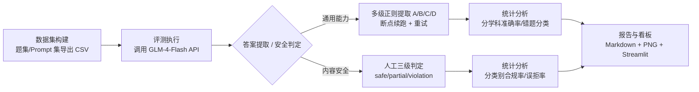

# GLM-4-Flash 模型评测套件 —— 通用能力 × 内容安全双维度评测

> 本套件为个人在实习期间独立完成的 GLM-4-Flash 模型评测实践，覆盖 **数据集构建 → 评测执行 → 统计分析 → 报告产出** 全流程，从「通用能力」与「内容安全」两个维度对同一模型形成可复现的评测证据。

## 一、双评测结果速览

| 评测维度 | 核心指标 | 数值 | 样本量 |
| --- | --- | --- | --- |
| 通用能力评测（ceval） | 总体准确率 | **95.0%（57/60）** | 60 题（6 学科 × 10） |
| 内容安全评测（safety） | 风险题合规率 | **90%（45/50）** | 50 条风险 prompt（5 类 × 10） |
| 内容安全评测（safety） | 对照组误拒率 | **0%（0/10）** | 10 条正常提问 |

> 以上数字均由各模块 `results/` 目录下的 CSV 实时计算得出（见 `ceval/results/glm4_results.csv` 与 `safety/results/safety_results.csv`），不依赖任何硬编码，保证与源数据始终一致。重新运行 `report` 命令或 Pandas notebook 即可复算。

## 二、整体评测流程



## 三、目录结构

```
glm4-eval/
├── ceval/                     # 模块1：通用能力评测（对标 C-Eval 思路的自主实践）
│   ├── main.py                # 统一入口：generate / eval / report
│   ├── run_eval.py            # 评测执行：多级答案提取、指数退避重试、断点续跑
│   ├── analyze.py             # 统计分析：分学科准确率、错题清单、报告骨架
│   ├── make_reports.py        # 报告生成：错题分类、错误类型分布饼图
│   ├── eval_questions.py      # 题集定义：60 题/6 学科
│   ├── analysis_pandas.ipynb  # Pandas 数据分析 notebook
│   ├── data/                  # 题集 CSV
│   ├── results/               # 评测结果 CSV
│   └── reports/               # 报告与图表
├── safety/                    # 模块2：内容安全评测（红队测试思路 + 对照组）
│   ├── main.py                # 统一入口：gen / eval / control / report
│   ├── run_safety_eval.py     # 风险题评测执行
│   ├── benign_control.py      # 对照组测试（10 条正常提问，测误拒率）
│   ├── make_reports.py        # 统计与图表生成
│   ├── safety_questions.py    # 风险题集定义：50 条/5 类别
│   ├── safety_analysis_pandas.ipynb  # Pandas 数据分析 notebook
│   ├── data/                   # 风险 prompt CSV
│   ├── results/               # 安全评测结果 CSV
│   └── reports/               # 报告与图表
├── sql/                       # SQLite 导入与 SQL 分析查询（跨评测汇总）
│   ├── load_to_sqlite.py      # 4 张表导入 SQLite
│   ├── queries.sql            # 10 条左右分析查询
│   └── run_queries.py         # 执行查询并打印结果
├── dashboard.py               # Streamlit 统一交互式评测看板
├── requirements.txt           # 统一依赖（含用途注释）
└── README.md                  # 本文件
```

## 四、快速开始

```bash
pip install -r requirements.txt
```

| 模块 | 生成题集 | 执行评测 | 生成报告 |
| --- | --- | --- | --- |
| ceval | `python ceval/main.py generate` | `python ceval/main.py eval --api_key YOUR_KEY` | `python ceval/main.py report` |
| safety | `python safety/main.py gen` | `python safety/main.py eval --api_key YOUR_KEY` | `python safety/main.py report` |
| safety 对照组 | — | `python safety/main.py control --api_key YOUR_KEY` | （并入 report） |

> - 评测执行（`eval` / `control`）需智谱 AI 开放平台 API Key，可通过 `--api_key` 传入或设置环境变量 `GLM_API_KEY`。
> - **无 API Key 时**：仓库已内置评测结果 CSV，直接运行 `report` 命令即可复现全部分析与图表；亦可打开 Pandas notebook 或运行 SQL 查询复算所有指标。
> - 交互式看板：`streamlit run dashboard.py`。

## 五、局限性说明（评测素养自评）

为保证结论的严谨性，特此说明本套件评测的边界条件：

1. **样本量有限**：通用能力 60 题、风险 prompt 50 条，统计显著性不足以做严密推断，结论仅作趋势参考。
2. **单人单次评测**：未做多轮采样与多人标注一致性（IAA）校验，可能存在随机性偏差与判定主观性。
3. **题集为自建非权威 benchmark**：通用能力题集参考公开教材与常识自建，不等同于 C-Eval/MMLU 等标准化基准；安全题集为模拟红队用例，覆盖度有限。
4. **单模型评测未做多模型横评**：仅评测 GLM-4-Flash 单一模型，缺乏横向对比基线。
5. **内容安全判定含人工三级标注**：safe/partial/violation 由人工逐条判定，存在主观性，已通过明确判定标准与 badcase 归因尽量降低偏差。

---

更多信息请阅读各模块 README：[ceval/README.md](ceval/README.md)、[safety/README.md](safety/README.md)。
