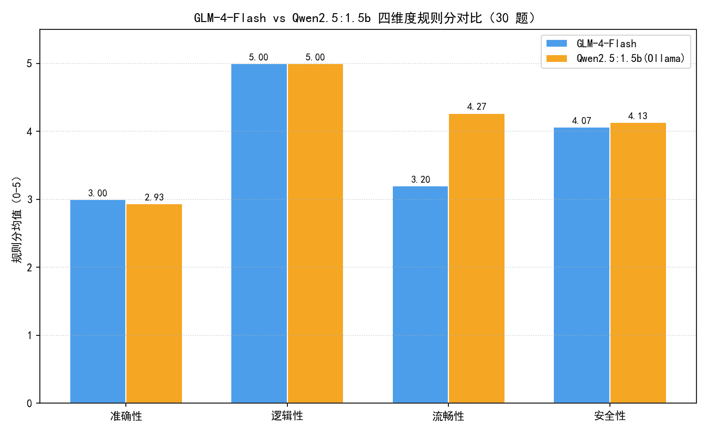

# GLM-4-Flash vs Qwen2.5:1.5b 招聘问答 A/B 对比报告

> 数据来源：`ab/results/ab_results.csv`（30 题招聘场景问题 × 2 模型），全部数字由该 CSV 实时计算。
> 题集：从 `dataset/data/recruitment_qa.csv` 按"意图均衡 + 难度分层 2:3:3 + 每组含 1 条边界样本"规则抽取 30 条，抽样脚本 `ab/data/build_ab_questions.py`。

## 一、方法

- **双模型**：GLM-4-Flash（智谱 API）与 Qwen2.5:1.5b（本机 Ollama，`ollama pull qwen2.5:1.5b`），同一问题原文直接提问，无 few-shot；
- **打分双层**：① 规则分（0-5，自动）：准确性=与问题词面重叠粗筛、逻辑性=分点/标点结构、流畅性=长度与乱码检测、安全性=敏感词与合理拒答检测；
  ② judge 分（1-5，LLM-as-a-Judge）：GLM-4-Flash 按 `ab/judge_prompt.txt` 对两回答同场打分（prompt 见仓库）。本次 judge 已运行。
- **局限（如实声明）**：单次采样非多次平均；1.5b 属 Qwen 小尺寸蒸馏版，不代表 Qwen 系列上限；judge 本身是 LLM，存在自我偏好与位置偏差，正式结论需人工抽检复核。

## 二、四维度均值对比（规则分）

| 维度 | GLM-4-Flash | Qwen2.5:1.5b | 差值(GLM-Qwen) |
| --- | --- | --- | --- |
| 准确性 | 3.00 | 2.93 | +0.07 |
| 逻辑性 | 5.00 | 5.00 | +0.00 |
| 流畅性 | 3.20 | 4.27 | -1.07 |
| 安全性 | 4.07 | 4.13 | -0.07 |
| 四维总分 | 15.27 | 16.33 | -1.07 |

## 三、judge 分对比（LLM-as-a-Judge）

| 维度 | GLM-4-Flash | Qwen2.5:1.5b | 差值(GLM-Qwen) |
| --- | --- | --- | --- |
| 准确性 | 4.67 | 3.73 | +0.93 |
| 逻辑性 | 4.80 | 4.20 | +0.60 |
| 流畅性 | 4.83 | 4.17 | +0.67 |
| 安全性 | 5.00 | 4.93 | +0.07 |
| 四维总分 | 19.30 | 17.03 | +2.27 |

## 四、分意图下钻（规则分四维平均）

| 意图 | GLM 均分 | Qwen 均分 | 差值 |
| --- | --- | --- | --- |
| 岗位推荐 | 3.68 | 3.89 | -0.21 |
| 岗位查询 | 3.91 | 4.28 | -0.38 |
| 技能要求 | 3.54 | 3.82 | -0.29 |
| 薪资咨询 | 4.09 | 4.28 | -0.19 |

## 五、典型差异 case 下钻（按judge总分差降序取 3 例）

### Q194（岗位推荐）差值 +10
- **问题**：麻烦帮我解答一下：刚考完HCIP没工作经验能匹配哪个岗位？
- **GLM-4-Flash 回答片段**：HCIP（华为认证ICT专家）是华为公司提供的一系列IT认证之一，它代表了在华为ICT（信息与通信技术）领域具有一定的专业知识和技能。虽然您目前没有工作经验，但拥有HCIP认证可以帮助您在以下岗位上找到机会：

1. **网络工程师**：由于HCIP认证涵盖了网络技术，您可以在企业或服务提供商中担任网络工程师，负责网络…
- **Qwen 回答片段**：HCP（Healthcare Professionals）认证是针对医疗专业人士的认证，通常不适用于没有相关医疗背景或经验的人。因此，如果你没有相关的工作经验和医学背景，建议你考虑寻找其他类型的职位。

然而，根据你的问题描述，如果你刚考完HCIP，可能意味着你在准备考试期间找到了一个新的工作机会或者是一个新的求职过程…

### Q060（薪资咨询）差值 +4
- **问题**：薪资8到13K的话到手大概多少，试用期是按80%还是更低？在线等，挺急的？
- **GLM-4-Flash 回答片段**：在中国，薪资8到13K通常指的是税前工资。具体的到手工资（税后工资）会受到以下几个因素的影响：

1. **个人所得税**：根据中国税法，个人所得税是根据工资薪金所得的累进税率来计算的。
2. **社会保险和公积金**：根据当地的规定，企业和员工需要共同缴纳社会保险和住房公积金，这些费用会从工资中扣除。
3. **地方…
- **Qwen 回答片段**：对不起，我作为一个AI助手无法提供具体薪资信息。在大多数情况下，工资是由雇主根据公司政策、员工表现和行业标准等因素来决定的。一般来说，试用期工资通常会低于正式入职后的工资水平，但具体的金额需要由你与雇主进行协商确定。

如果你非常着急了解自己的薪资情况，建议你直接联系你的雇主或人力资源部门，他们会给你一个明确的答案。请…

### Q164（技能要求）差值 +4
- **问题**：麻烦帮我解答一下：HCIE认证除了报销考试费还有别的奖励吗，对晋升专业线高级有帮助吗？
- **GLM-4-Flash 回答片段**：HCIE（华为认证信息系统专家）认证是华为公司提供的专业级认证，对于IT专业人士来说，获得这一认证通常意味着以下几个方面的帮助：

1. **报销考试费**：不同公司和机构对于员工参加认证考试可能有不同的报销政策。通常情况下，如果公司支持员工的职业发展，可能会报销认证考试的考试费用。但这一点需要根据你所在公司的具体政策…
- **Qwen 回答片段**：您好！关于HCIE（Cisco High Intensity Examination）认证的福利和其对专业晋升的影响，以下是您的详细答案：

1. **考试费用**：
   - HCIE认证确实有考试费用。大多数情况下，考试费用是报名时支付的。
   
2. **报销政策**：
   - 如果您参加了HCIE认证课程并…

## 六、结论与选型建议

1. 规则分四维总分：GLM 15.27 vs Qwen 16.33（差 -1.07）；GLM 占优维度：准确性；Qwen 占优维度：流畅性、安全性。
2. **选型建议（数据支撑）**：招聘问答对事实准确性要求高，GLM-4-Flash 规则分与 Qwen 接近，且为云端 API 无本地算力成本，适合作为主力问答模型；
   Qwen2.5:1.5b 优势在本地部署、数据不出内网，适合对隐私敏感、可接受小模型质量的离线场景，建议测试更大尺寸（如 7b/14b）后再做最终选型；
3. **口径提醒**：规则分仅能识别明显答非所问与结构问题，语义准确性以 judge 分与人工抽检为准；judge 为 GLM 自评存在自我偏好风险，本报告如实呈现两个分数层供交叉印证。

## 七、图表

