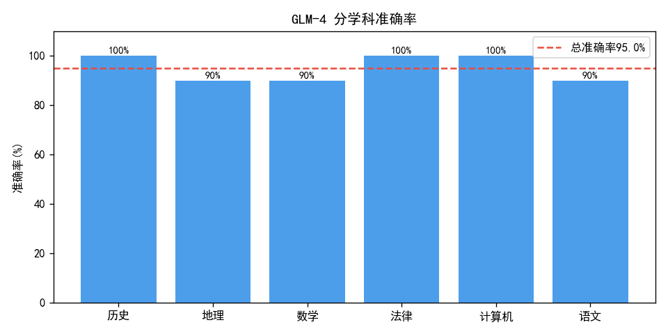
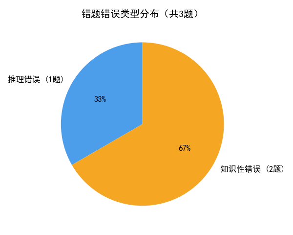
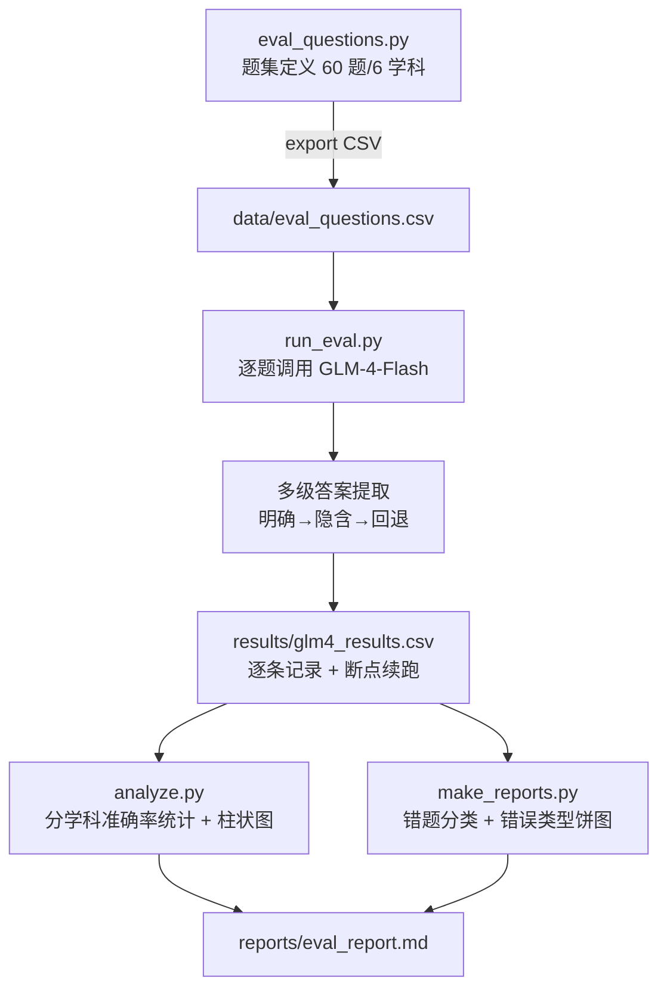

# 基于 C-Eval 思路的 GLM-4-Flash 通用能力评测

> 基于自建中文多学科题集的 GLM-4-Flash 通用能力评测（对标 C-Eval 思路的自主实践），完成「出题 → 调模型 → 自动评分 → 错题归因」全流程，覆盖 6 个学科共 60 道单选题的 zero-shot 评测。

## 一、评测结果明细

> 数据来源：`results/glm4_results.csv`（由 `run_eval.py` 评测生成），以下数字均由该 CSV 与 `analyze.py` 实时计算得出。

### 总体指标

| 指标 | 数值 |
| --- | --- |
| 总题数 | 60 |
| 正确数 | 57 |
| **总体准确率** | **95.0%（57/60）** |
| 格式解析失败 | 0 题 |

### 分学科准确率

| 学科 | 正确/总数 | 准确率 |
| --- | --- | --- |
| 计算机 | 10/10 | 100.0% |
| 数学 | 9/10 | 90.0% |
| 语文 | 9/10 | 90.0% |
| 历史 | 10/10 | 100.0% |
| 地理 | 9/10 | 90.0% |
| 法律 | 10/10 | 100.0% |

### 错题归因

| 学科 | 错题 | 错误类型 | 错因分析 |
| --- | --- | --- | --- |
| 数学（圆面积） | idx 11 | 推理错误 | 模型答 B(18.84) 恰为周长 2πr，误用周长公式算面积（正确 πr²=28.26），属公式混淆 |
| 语文（文言被动句） | idx 27 | 知识性错误 | 古汉语语法判断错误，"兔不可复得"为被动句未识别，属事实性知识欠缺 |
| 地理（省级行政区） | idx 43 | 知识性错误 | 山东不与内蒙古接壤（中间隔河北），误选陕西，属地理事实记忆错误 |





## 二、模块评测流程



## 三、数据集说明

- **规模**：60 道单选题，6 个学科各 10 题（计算机 / 数学 / 语文 / 历史 / 地理 / 法律）。
- **构成**：每题包含题干、4 个选项（A/B/C/D）与标准答案，存放于 `data/eval_questions.csv`，由 `eval_questions.py` 内置题库导出。
- **设计标准**：
  - **答案唯一性**：每题标准答案明确且唯一，避免多解争议。
  - **干扰项有效性**：错误选项基于常见错误认知设计（如圆面积题中混入周长数值作为干扰项），具备一定区分度。
  - **学科均衡性**：各学科题量均等（10 题/科），便于横向对比学科间能力差异。
- **定位**：自建题集参考公开教材与常识，对标 C-Eval 的多学科评测思路，但不等同权威 benchmark，仅作能力分布趋势参考。

## 四、评测方法说明

### 4.1 多级答案提取策略

`run_eval.py` 的 `extract_answer()` 对模型自由文本回答按优先级三级提取选项字母：

1. **明确答案模式**：优先匹配"答案是 X / 正确答案 X / 选 X"等明确表述——最可靠。
2. **隐含答案模式**：匹配"因此选 X / 所以 X / 建议选择 X"等推理结论表述——次可靠。
3. **回退策略**：提取文本中出现的首个 A/B/C/D 字母——兜底手段。
4. **异常处理**：空串、错误响应前缀（`__ERROR__:`）直接返回 `PARSE_FAIL`，不计入正确。

### 4.2 指数退避重试

调用智谱 API 时最多重试 5 次：
- **429 限流**：线性退避（8s/16s/24s/32s），给配额恢复留足时间。
- **其他 HTTP 错误 / 网络异常**：指数退避（2s/4s/8s/16s）。
- 全部失败返回 `__ERROR__:` 占位串，不中断整体评测流程。

### 4.3 断点续跑

`load_done()` 读取已有结果 CSV 构建 idx→记录映射，重跑时跳过已完成题目，避免重复调用 API，适配网络中断后恢复。

### 4.4 评分口径

- Prompt 采用 zero-shot，明确要求"只输出一个字母(A/B/C/D)，不要解释"，`temperature=0.1` 降低随机性。
- 提取的字母与标准答案比对，`correct` 列记 Y/N；未输出字母记为格式解析失败（本次为 0 题）。

## 五、快速开始

两种运行方式均支持（路径基准已改造为基于脚本位置的绝对路径）：

```bash
# 方式1：从仓库根目录运行（推荐）
python ceval/main.py generate            # 生成题集到 ceval/data/
python ceval/main.py eval --api_key YOUR_KEY   # 执行评测（需 API Key）
python ceval/main.py report              # 生成报告与图表

# 方式2：进入模块目录运行
cd ceval
python main.py generate
python main.py eval --api_key YOUR_KEY
python main.py report
```

> 无 API Key 时，仓库内置 `results/glm4_results.csv`，直接运行 `report` 或打开 `analysis_pandas.ipynb` 即可复现全部分析结果。
