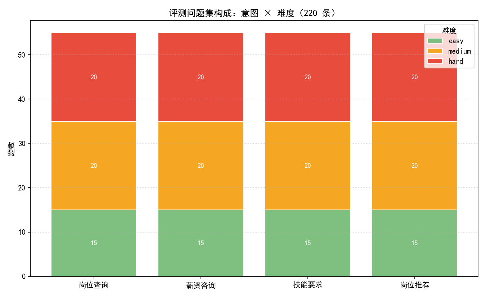
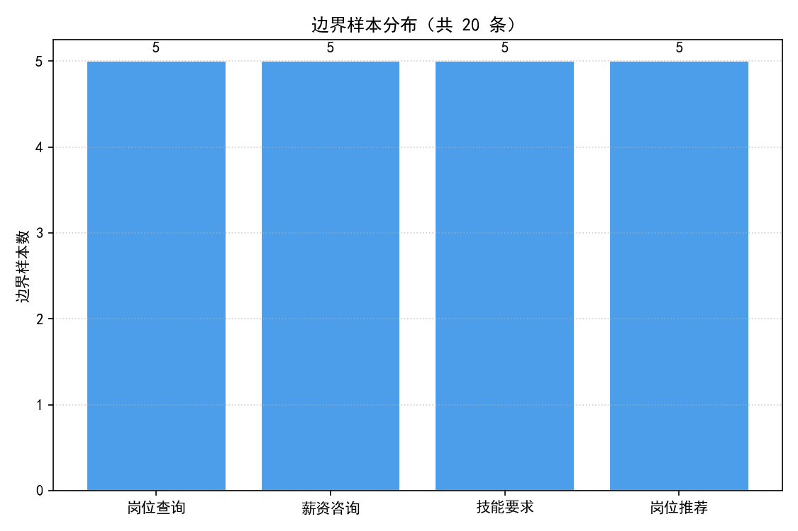

# 招聘问答评测问题集构成报告

> 数据来源：`dataset/data/recruitment_qa.csv`，全部数字由该 CSV 实时计算。
> 质控流程（试标→修正→全量→复核）与复核一致率记录见 `dataset/docs/标注质控流程.md`。

## 一、数据集构成

| 构成维度 | 分布 |
| --- | --- |
| 总量 | 220 条（满足「200+」承诺） |
| 意图：岗位查询（存在性/归属/职责/流程等客观信息） | 55 条（25.0%） |
| 意图：薪资咨询（工资结构/发放/奖金/试用期折算） | 55 条（25.0%） |
| 意图：技能要求（认证/工具/协议/经验门槛） | 55 条（25.0%） |
| 意图：岗位推荐（带个人条件的匹配与比较） | 55 条（25.0%） |
| 难度 | easy 60 / medium 80 / hard 80 |
| 边界样本 | 20 条（9.1%），标注 boundary_case=True 并归档于生成工具独立种子 |

## 二、设计说明

- 意图体系与判定边界依据 `dataset/docs/标注规范.md`（v2，含 2 处试标后修订）；
- 问法多样性通过「11 条手写种子 × 5 个确定性问法变体」实现，构建工具 `data/build_recruitment_qa.py` 可一键复现；
- 复合问题按「第一诉求归类 + notes 记录其余诉求」处理，与质控流程阶段二修订一致。

## 三、图表

## 四、用途与衔接

- 本问题集用于招聘问答评测（对应简历实习职责 1）；
- `ab/` 模块从本集中按意图均衡抽样 30 条做双模型 A/B 对比；
- `data/dirty_samples.csv` + `clean.py` 演示原始数据的格式清洗与结构化整理。