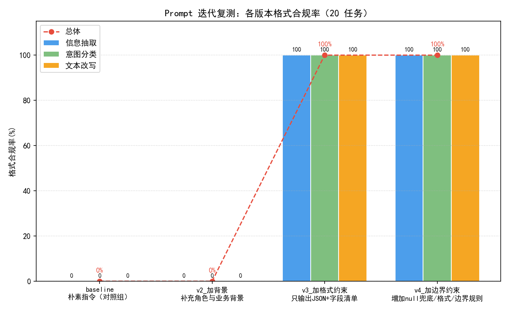

# Prompt 迭代复测报告（结构化输出任务）

> 数据来源：`prompts/results/prompt_eval_results.csv`（20 条任务 × 4 版模板，共 80 次调用），全部数字由该 CSV 实时计算。

## 一、迭代方法（背景 → 格式 → 约束 三步演进）

| 版本 | 迭代动作 | 解决什么问题 |
| --- | --- | --- |
| baseline | 朴素指令，无任何要求 | 对照组，暴露全部问题 |
| v2 | 补充角色与业务背景 | 模型不了解招聘域术语与任务语境 |
| v3 | 只输出 JSON + 字段清单 | 输出夹带解释/代码块，无法程序化解析 |
| v4 | null 兜底/日期薪资格式/矛盾标注 | 文本信息缺失时编造、格式不统一等边界问题 |

## 二、各版本格式合规率

| 版本 | 说明 | 抽取 | 分类 | 改写 | 总体 |
| --- | --- | --- | --- | --- | --- |
| baseline | 朴素指令（对照组） | 0% | 0% | 0% | **0%** |
| v2_加背景 | 补充角色与业务背景 | 0% | 0% | 0% | **0%** |
| v3_加格式约束 | 只输出JSON+字段清单 | 100% | 100% | 100% | **100%** |
| v4_加边界约束 | 增加null兜底/格式/边界规则 | 100% | 100% | 100% | **100%** |

分类任务标签有效率（输出类别 ∈ 给定 4 类的比例）：baseline 0%；v2_加背景 0%；v3_加格式约束 83%；v4_加边界约束 83%。

## 三、典型改善 case（baseline 不合规 → v4 合规，共 3 条，取前 3）

### C1（意图分类）
- **输入**：见 `prompts/data/test_cases.csv` 中 C1 行
- **baseline 输出（不合规）**：试用期社保的缴纳时间通常由当地的社会保险政策以及企业的相关规定共同决定。以下是一些常见的情况：  1. **同时缴纳**：在很多地方，企业会要求在员工入职后立即开始缴纳社保，包括试用期。这意味着从员工入职的第一天开始，企业和员工就需要按照规定缴纳相应的社会保险费用。  2. **转正后缴纳**：有些企业可能会规定在员工转正之后才开始缴纳社保，即试用期内的社保费用由企业承担或者员工自付。  具体到您…
- **v4 输出（合规）**：{   "意图": "薪资咨询",   "岗位查询": null,   "技能要求": null,   "岗位推荐": null,   "试用期社保开始时间": "null",   "转正后是否交社保": "是（存疑）" }

### C2（意图分类）
- **输入**：见 `prompts/data/test_cases.csv` 中 C2 行
- **baseline 输出（不合规）**：HCIP（华为认证信息网络专家）证书对于运维岗位的晋升评级是有一定帮助的。  以下是具体分析：  1. **专业能力证明**：HCIP证书是华为认证体系中的一级认证，它证明了持有者具备一定的网络技术和运维管理能力。在运维岗位中，这种专业能力的证明对于晋升和评级是非常有利的。  2. **技能提升**：获得HCIP证书需要通过相应的培训和考试，这有助于运维人员提升自己的技术水平和解决问题的能力，这对…
- **v4 输出（合规）**：```json {   "意图": "技能要求",   "技能名称": "HCIP证书",   "岗位类型": "运维",   "晋升评级": "有帮助（存疑）" } ```

### C3（意图分类）
- **输入**：见 `prompts/data/test_cases.csv` 中 C3 行
- **baseline 输出（不合规）**：当然，有很多测试岗位适合有一定Python基础的应届生。以下是一些建议：  1. **功能测试工程师**：这个岗位通常要求具备基本的编程能力，Python作为一种流行的脚本语言，可以帮助你进行自动化测试，特别是在测试数据准备和测试用例执行方面。  2. **自动化测试工程师**：如果你的Python基础不错，这个岗位非常适合你。自动化测试工程师需要能够编写测试脚本来自动化测试流程，提高测试效率。 …
- **v4 输出（合规）**：```json {   "意图": "岗位推荐",   "岗位查询": "测试岗",   "技能要求": ["Python"],   "薪资咨询": null,   "岗位推荐": "适合应届生的测试岗" } ```

## 四、结论

1. 总体合规率演进：baseline 0% → v2 0% → v3 100% → v4 100%。
2. 最大增益来自 v3_加格式约束（较上一版 +100 个百分点），说明结构化输出场景下格式约束缺失是主要失效根因；
3. 分类任务在加入字段清单与类别约束后，标签有效率维持 83%，说明类别约束有效防止了自由发挥；
4. 复用建议：模板可直接迁移到其他域的结构化抽取任务（替换 field_spec 即可），方法论按"背景→格式→约束"顺序迭代，每步只加一类约束，便于归因。

## 五、局限（如实声明）

- 每版本每题单次采样，合规率受单次生成波动影响（正式评估建议每题 3 次取多数）；
- 合规判定只覆盖"可解析 + 字段齐全"，字段值的内容正确性需人工抽检（本轮未做全量人工核对）；
- 任务仅 20 条、单一模型（GLM-4-Flash），结论不外推到其他模型。

## 六、图表

