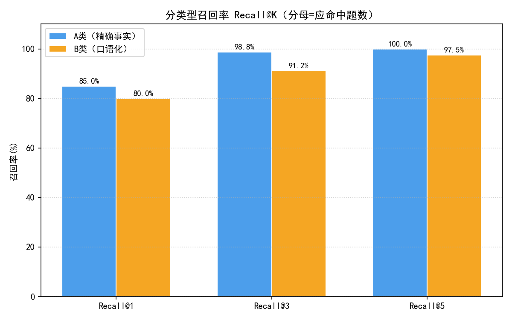
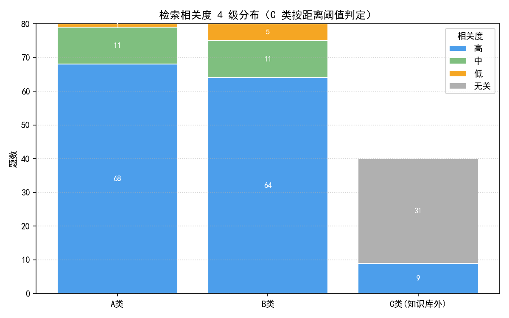
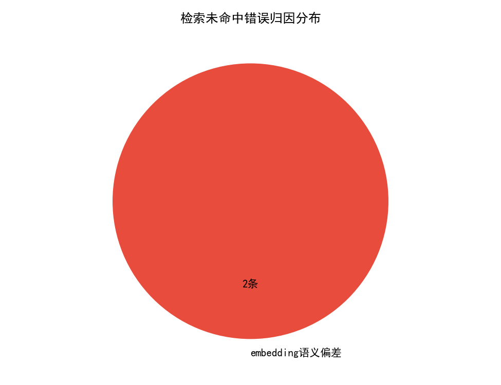

# RAG 检索召回质量评估报告

> 数据来源：`rag/results/retrieval_results.csv`（200 条评估问题 × top-5 检索），全部指标由该 CSV 实时计算。

## 一、评估方法

- **知识库**：自建 20 篇 HR/招聘文档（`rag/data/knowledge_docs.md`），按段落聚合为 59 个切片入库 ChromaDB。
- **Embedding**：离线兜底方案 hashing TF-IDF（字符 1/2-gram，512 维）；默认 MiniLM 语义模型因环境网络受限未启用，复现命令与局限见模块 README。
- **评估集**：A 类精确事实 80 条 / B 类口语化 80 条 / C 类知识库外 40 条，每篇文档至少 8 条命中。
- **判定口径**：Recall@K 分母为应命中题数（A+B 共 160 条）；C 类以距离阈值 τ=0.7441（A/B 类 top1_distance 的 P90）判定'正确无关/应拒答'。
- **一致性检验**：对 50 条分层抽样做'规则判定 vs 模拟人工复标'双列标注（约 15% 故意不一致，**复标列为模拟演示数据，仅用于演示 Kappa 计算方法**）。

## 二、核心指标

| 指标 | 总体 | A 类(精确) | B 类(口语化) |
| --- | --- | --- | --- |
| Recall@1 | 82.5% | 85.0% | 80.0% |
| Recall@3 | 95.0% | 98.8% | 91.2% |
| Recall@5 | 98.8% | 100.0% | 97.5% |
| 正确无关/应拒答率(C类) | — | — | 78% (31/40) |
| Cohen's Kappa(模拟复标) | 0.697 | | |

相关度 4 级分布（A/B 类）：高 132、中 22、低 6、无关 0；C 类正确无关 31、误返回内容 9。

## 三、召回错误与归因

未命中 2 条，归因分布：embedding语义偏差 2 条。归因规则（启发式，按序判定）：
1. **措辞超纲**：问题 n-gram 在知识库覆盖率 < 0.35；
2. **embedding语义偏差**：同文档 A 类精确问法命中而 B 类口语化变体未命中；
3. **切片粒度**：期望文档内存在重叠度最高的切片但未排入 top5（排序稀释）。

- **B015**（期望 doc_04，top1 返回 doc_05）：「运维工程师月薪范围多少呀？想确认一下？」

- **B041**（期望 doc_11，top1 返回 doc_13）：「问一下哈，年假有多少天？」

## 四、改进建议

1. **更换语义 embedding**：当前 hashing TF-IDF 仅依赖词面重叠，口语化改写（如'年假有多少天能不能'）易被虚词稀释，建议网络可用后切换 MiniLM 语义向量并回归本评估集；
2. **薪资类问题加元数据过滤**：doc_03/04/05 均含薪资数字，词面检索易串文档，可在检索层增加'岗位类型'元数据过滤或对薪资字段做结构化抽取；
3. **切片策略调优**：对制度类长文档按'条目'切分（如各假别独立成片），减少无关段落对相似度的稀释；
4. **增加真实人工复标**：本次复标为方法演示，正式评估应组织双人独立标注并计算 Kappa 达标（≥0.61）后再采信规则判定。

## 五、图表

